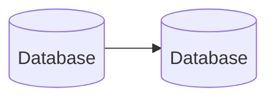

# Sample show
## Getting up

- Turn off alarm
- Get out of bed

------------------

## Abbildungen und Tabellen

Zur Nummerierung von Abbildungen wird einfach `{#fig:your-label}` ans Ende gesetzt. Auf diese kann dann mit `[@fig:black-box]` im Text verwiesen werden: (siehe [@fig:black-box]). Mit `pandoc-crossref-de.yml` wird die standardmäßige englische Ausgabe überschrieben (momentan deutsch).

::: columns
:::: column

{#fig:black-box}

::::
:::: column

|         term        | freq | freq.rel |
| ------------------- | ---- | -------- |
| R                   |  259 |        1 |
| TEI                 |  155 |      0.6 |
| internet            |  134 |     0.52 |
| NLP                 |  118 |     0.46 |
| XML                 |  117 |     0.45 |
| GitHub              |   98 |     0.38 |
| API                 |   88 |     0.34 |
| OA                  |   77 |      0.3 |
| ML                  |   76 |     0.29 |
| GIS                 |   70 |     0.27 |

: Absolute und relative Häufigkeit von Begriffen, ADHO Konferenzen, 2014--18 {#tbl:freq-adho}

::::
:::

::: notes

- ein Kommentar zu dieser Folie

:::

## Multi-column layout

::: columns-3
:::: column

### List

- Eat eggs
- Drink coffee

::::
:::: column

### Lorem ipsum

Massa vivamus bibendum nisl nec pellentesque quis tortor molestie congue aliquam mattis pretium, aptent scelerisque montes habitant ligula maecenas primis dui sollicitudin morbi tempor.
::::
:::: column

### Lorem ipsum

Ac maximus per arcu in facilisi laoreet ornare tempor posuere luctus at, nisl himenaeos lacus sed risus inceptos donec dignissim vel.

::::
:::

## Diagramme

Test für [mermaid.js](https://mermaid.js.org)

## Citations

Literaturangaben können mit Pandoc und Citeproc ganz simpel als `[@citekey]` gemacht werden. Die Bibliographie, am besten als `CSL JSON`, muss im YAML mit `bibliography: path/to/bibliography.csl.json` verlinkt werden. Beispielzitation [@Drucker2021DHCoursebook]

## Literatur {#refs}